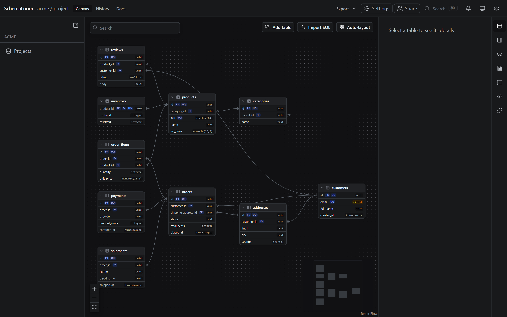
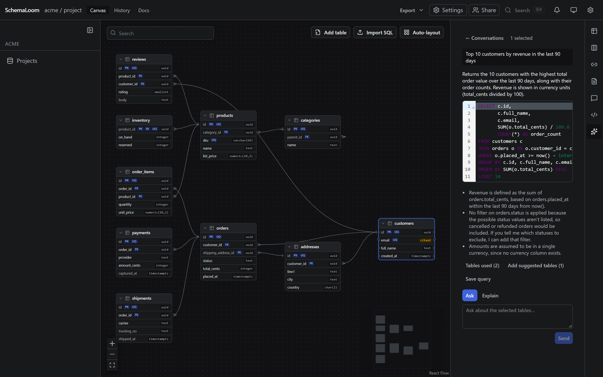
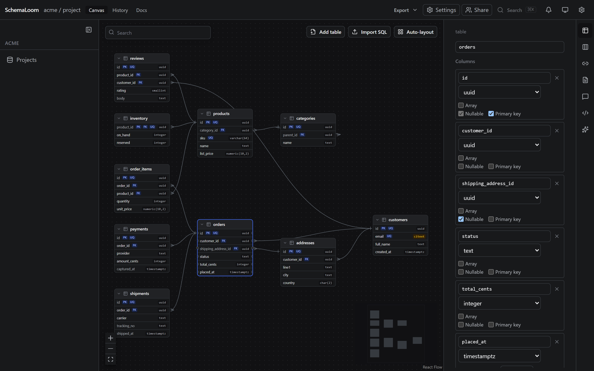
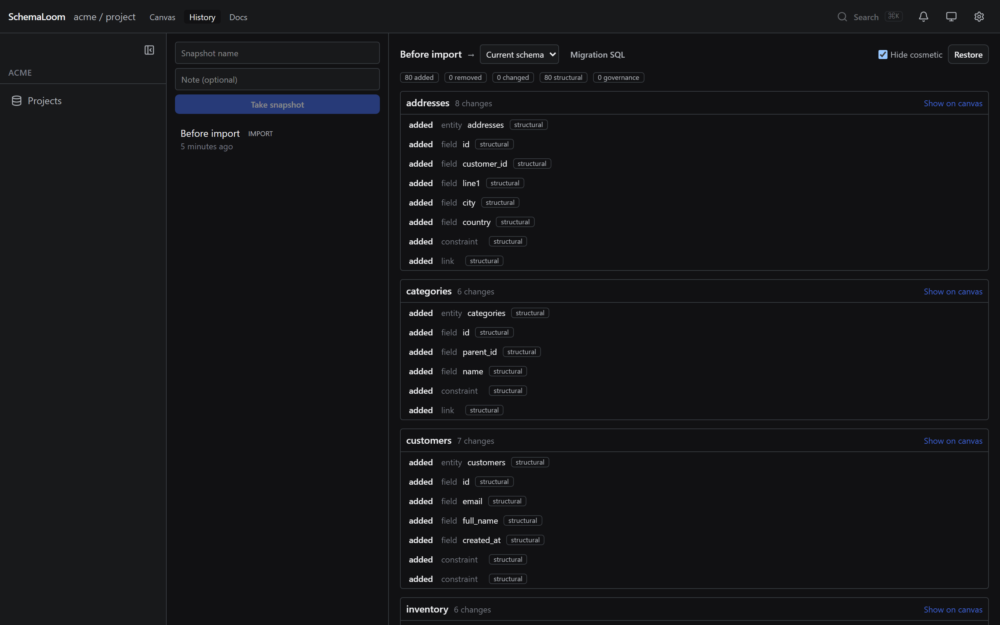

# SchemaLoom

Visual database design workspace: design schemas on a canvas, document every table and
column, and generate queries with AI from a selection — where the AI only ever sees what
you selected and what you are allowed to see.

PostgreSQL in v1, behind a pluggable engine architecture so other engines arrive later as
packages rather than as changes to core code.



<table>
  <tr>
    <td width="50%">
      
      <p><b>Ask in plain English.</b> Select tables and get SQL back, with the assumptions
      it made spelled out. The AI sees only what you selected and are allowed to see.</p>
    </td>
    <td width="50%">
      
      <p><b>Edit tables in place.</b> Click a table to change its columns, types, keys and
      nullability. Changes show up live for everyone on the project.</p>
    </td>
  </tr>
  <tr>
    <td width="50%">
      
      <p><b>Snapshots and diffs.</b> Compare any snapshot with the current schema, get the
      migration SQL, or restore it.</p>
    </td>
    <td width="50%" valign="top">
      <p><b>Start from what you already run.</b> Paste a <code>pg_dump</code> or a migration
      file and SchemaLoom lays it out on the canvas for you. Importing again merges
      additively.</p>
      <p><b>Share at any level.</b> Grant access to a project, an area or a single table, or
      send a view-only link with an expiry and an optional password.</p>
    </td>
  </tr>
</table>

To refresh these screenshots, run `pnpm dev` against a seeded database, then
`pnpm --filter @schemaloom/e2e screenshots`.

---

## Use pnpm, not npm

```bash
pnpm install
```

**`npm install` does not work and cannot be made to fail politely.** It dies with:

```
npm error code EUNSUPPORTEDPROTOCOL
npm error Unsupported URL Type "catalog:": catalog:
```

Two pnpm-only features are load-bearing here:

| Feature                | Where                 | Why it matters                                                                                                                                                                                                                                                             |
| ---------------------- | --------------------- | -------------------------------------------------------------------------------------------------------------------------------------------------------------------------------------------------------------------------------------------------------------------------- |
| `catalog:`             | `pnpm-workspace.yaml` | One declared version per shared dependency across 9 packages                                                                                                                                                                                                               |
| `node-linker=isolated` | `.npmrc`              | Each package's `node_modules` holds only its own declared dependencies, so an undeclared import is an unresolvable module rather than a lucky hoist. This is what makes the package boundaries a fact instead of a lint rule — notably "the API bundle contains no React". |

npm resolves `catalog:` before it runs any lifecycle script, so a `preinstall` guard
(`only-allow`) and `engine-strict` both fire too late to help. Both were tried and
removed. The README is the only place this warning can live.

Getting pnpm:

```bash
npm install -g pnpm@10
```

or via corepack:

```bash
corepack enable && corepack prepare pnpm@10.32.1 --activate
```

Node >= 22.12 is required (`.nvmrc` pins 22; 24 works).

---

## Getting started

```bash
cp .env.example .env
```

Then fill in the four required secrets in `.env` — generate each with:

```bash
node -e "console.log(require('crypto').randomBytes(48).toString('base64url'))"
```

`JWT_ACCESS_SECRET`, `JWT_REFRESH_SECRET` and `CSRF_SECRET` take that value.
`SECRETS_ENCRYPTION_KEY` needs 32 raw bytes instead:

```bash
node -e "console.log(require('crypto').randomBytes(32).toString('base64'))"
```

Start the stateful services (Postgres 16, Redis 7, MinIO, Mailpit):

```bash
pnpm infra:up
```

Then install and verify:

```bash
pnpm install && pnpm build && pnpm test
```

`apps/web` and `apps/api` run on the **host** via `pnpm dev`, not in Docker — faster
restarts, working debuggers, and no bind-mount file-watching problems (which are worst on
Windows, the primary dev platform here).

> Postgres and MinIO read their credentials only when the data volume is first created.
> After changing one in `.env`, `docker compose down -v` — editing the file alone will not
> fix a running volume.

---

## Troubleshooting

**`EPERM: operation not permitted, unlink ... query_engine-windows.dll.node`**

A running API instance holds the Prisma query engine open, and `nest build` cannot
replace it. Stop the API before rebuilding. On Windows, `pkill -f 'node dist/main.js'`
from Git Bash does **not** kill native processes — find the PID and use taskkill:

```bash
tasklist //FI "IMAGENAME eq node.exe" //FO CSV
```

The API logs its own PID on every line, so the boot output tells you which one it is.

**Two `Unsupported route path: "/api/*"` warnings on boot** are emitted by Nest's own
handling of `setGlobalPrefix({ exclude })`. It auto-converts to `/api/{*path}` and works.
Not ours to fix.

---

## Layout

```
apps/api/                 NestJS — the only thing that talks to Postgres
apps/web/                 Next.js App Router
packages/
  schema-model/           engine-neutral IR + diff. Depends on zod only.
  engine-sdk/             EngineDefinition + EngineUiPlugin + conformance suite
  contracts/              zod request/response schemas, DTOs, permission atoms
  engines/postgresql/     the v1 engine (server) + ./static browser facet
  engines/postgresql-ui/  its React UI plugin
  ui/                     Radix + Tailwind component library
  config/                 tsconfig / eslint / tsup / vitest presets
e2e/                      Playwright, drives web + api over HTTP
```

Dependency edges only ever point downward; `schema-model` depends on nothing but zod, and
`engine-sdk` never imports React (its UI contract lives at `@schemaloom/engine-sdk/ui`).

---

## Commands

| Command                        | Does                                                |
| ------------------------------ | --------------------------------------------------- |
| `pnpm dev`                     | Every package in watch mode plus both apps          |
| `pnpm build`                   | Full build, dependency-ordered                      |
| `pnpm test`                    | Unit tests only — no Docker needed, stays cacheable |
| `pnpm test:int`                | Integration tests against real Postgres + Redis     |
| `pnpm test:e2e`                | Playwright against built apps                       |
| `pnpm typecheck`               | `tsc --noEmit` everywhere                           |
| `pnpm lint`                    | ESLint, type-aware                                  |
| `pnpm infra:up` / `infra:down` | Docker services                                     |

`test` excludes `*.int.spec.ts` on purpose: integration tests need Docker and a live
database, which would make `pnpm test` uncacheable and unrunnable on a clean machine.

**Deploying:** the web app and the api must share one hostname behind a reverse proxy. See
[`docs/deploy.md`](docs/deploy.md), and [`docs/self-host-ubuntu.md`](docs/self-host-ubuntu.md)
for a complete single-server setup.

---

## Design documents

Phase 1 was designed before any code was written. The documents are in `docs/phase1/`:

| File                          | Read it for                                                           |
| ----------------------------- | --------------------------------------------------------------------- |
| `REVIEW.md`                   | **Start here.** 500 lines, the whole design                           |
| `RECONCILIATION.md`           | Decisions that **override** the five documents below                  |
| `00-OVERVIEW.md`              | 138 decisions, contract ownership, ranked open questions, build order |
| `01-repo-layout.md`           | Tooling, module lists, the dependency-graph proof                     |
| `02-prisma-schema.md`         | The schema, indexing, cascades, polymorphism                          |
| `03-engine-sdk.md`            | The engine contract and the "adding MongoDB" proof                    |
| `04-schema-model-ir.md`       | IR types, the diff engine, redaction shape                            |
| `05-permission-resolution.md` | Atoms, the resolver, VisibilityFilter, the leak audit                 |

`RECONCILIATION.md` takes precedence where a design document disagrees with it.
